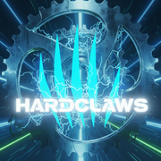
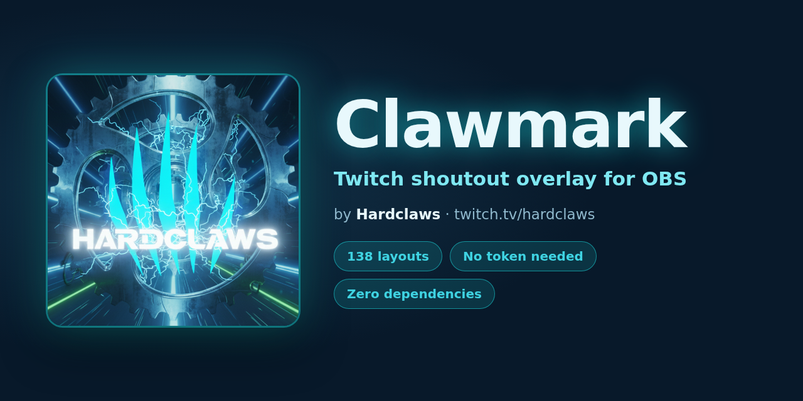

# Clawmark

**A Twitch shoutout overlay for OBS.** Someone types `!so thatstreamer` in your chat and
Clawmark plays one of their clips inside a hand-designed animated card - profile, follower
count, category, and who clipped it.

Created by **[Hardclaws](https://twitch.tv/hardclaws)** · thehardclaws@gmail.com


<br clear="left">



---

## What makes it different

- **138 hand-designed layouts** - 20 classic + **118 themed**, from Dragonfire and Ring of
  Power to Netrunner, Manga Page, Found Footage and Departure Board. None of them are
  generated from a template; each one is drawn by hand.
- **The clip is never covered.** Every layout gives the video its own 16:9 window sized to
  the space the text panels *don't* use. Verified by a pixel-level audit, not by eye.
- **Transparent by default**, so your gameplay shows through in OBS. All 138 checked.
- **No access token required.** Profile, avatar, bio, follower counts, category, clips and
  clip playback all work with zero credentials.
- **No build step, no dependencies, no server.** Static files.

---

## Quick start

1. Open **`index.html`** (the builder) - or use the hosted version once you've deployed it
2. Pick a layout and a theme
3. Enter your Twitch channel name
4. Copy the generated URL
5. In OBS: **+ → Browser Source → paste the URL**, set **1920 × 1080**
6. Tick **Shutdown source when not visible** and **Refresh browser when scene becomes active**

Type `!so someone` in your chat to fire it.

---

## The Hardclaws theme

The default palette is sampled straight from the Hardclaws logo - claw cyan `#1ffdff`,
deep navy `#0c2336`, steel blue `#327295` - and comes with a five-slash claw motif that
matches the mark. Pick **Hardclaws** in the theme list, or add `&skin=hardclaws` to the URL.

All 28 other presets still work on all 138 layouts.

---

## Credit

Clawmark is free to use and fork under the MIT licence. Credit isn't required, but if you
want to show it on stream there's a built-in badge.

**In the builder:** *Behaviour → Credit badge → "Show a small credit in the corner"*.
Tick it and a text box appears if you want to write your own wording.

**By URL:** add `&credit=1` for the default `Clawmark by Hardclaws`, or
`&credit=Your%20Text` for something custom.

It renders as a small pill in the bottom-right, fades in after the shoutout starts, and
never overlaps the clip. It is **off by default** so anyone who forks this doesn't
broadcast someone else's name by accident.

---

## Contact

**Hardclaws**
- Twitch: [twitch.tv/hardclaws](https://twitch.tv/hardclaws)
- Email: [thehardclaws@gmail.com](mailto:thehardclaws@gmail.com)

Bug reports and layout ideas are welcome - open a GitHub Issue or email me.

---


## Hosting it on GitHub Pages

Step-by-step walkthrough (no command line needed): **[GITHUB.md](GITHUB.md)**
(older notes in [DEPLOY.md](DEPLOY.md)). Short version: create a public
repo, upload the files, then Settings → Pages → Branch `main` / `(root)`. You get a permanent
`https://` URL to paste into OBS from any machine.

## Quick start

1. Run `serve.bat` (Windows) or `./serve.sh` (Mac/Linux), then open `http://localhost:8080/`.
2. Pick a layout, pick or generate a theme.
3. Enter your channel name. **No token needed.**
4. Use *Preview with a real channel* to test it on an actual streamer before committing.
5. Copy the generated URL into an **OBS Browser Source**.
6. Type `!so someone` in your chat.

### OBS Browser Source settings

| Setting | Value |
|---|---|
| Width × Height | **1920 × 1080** (scale the source in your scene, don't change these) |
| Shutdown source when not visible | **on** - stops audio on hidden scenes |
| Refresh browser when scene becomes active | **on** - reconnects chat reliably |
| Control audio via OBS | **on** - required or clip audio won't reach your stream |

---

## Commands

| Command | Who | Does |
|---|---|---|
| `!so <user>` | anyone (configurable) | Queue a shoutout. Multiple stack and play in order. |
| `!watchclip <user>` | anyone | Play a clip, bypassing the mods/VIPs restriction. |
| `!replayso` | anyone | Replay the last shoutout. Aliases: `!soreplay` `!clipreplay` `!replayclip` |
| `!stopclip` | mods only | Stop the current clip immediately. Aliases: `!sostop` `!clipstop` |
| `!clipreload` | mods only | Reload the browser source. Alias: `!soreload` |

The command name is configurable (`so`, `soclip`, `playclip`, …).

Test without chat, from the browser console:
```js
shoutout('someuser')
```

---

## Layouts

**138 hand-designed layouts** - 20 classic structural plus **118 themed** - in 30 groups,
plus 466,200 generated variations.

### The themed families

| Family | Count | Examples |
|---|---|---|
| Themed (classic set) | 20 | Comic Strip, VHS, Newspaper, Arcade, Blueprint, Glitch, Wanted Poster |
| Gaming | 8 | Victory Royale, Block World, Achievement, Speedrun, VS Screen, Kart Race |
| Fantasy | 6 | Character Sheet, Spell Scroll, Tavern Board, Rune Stone, Loot Drop |
| Cycling | 5 | Race Bib, Power Meter, Tour Jersey, Route Profile, Ride HUD |
| Retro / 8-bit | 5 | Pixel Quest, Handheld, Tape Loader, Demoscene, High Score |
| Magic | 5 | Arcane Circle, Dragonfire, Grimoire, Scrying Orb, Alchemy Bench |
| Epic Fantasy | 5 | Ring of Power, Herald's Banner, Wayfarer's Map, Dark Tower, Blade Oath |
| Steampunk | 4 | Brass Gauges, Airship Log, Clockwork, Telegram |
| **Sci-fi** | 6 | Starship Bridge, Hologram, Mech Cockpit, Warp Jump, Xeno Scan, Orbital Station |
| **Cyberpunk** | 6 | Neon Street, Netrunner, Augment Clinic, Megacorp Memo, Drone Feed, Synth Grid |
| **Horror** | 6 | Found Footage, Séance Board, Eldritch, Slasher Title, Haunted Mirror, Asylum File |
| **Anime** | 6 | Shonen Power-Up, Manga Page, Mecha Launch, Magical Girl, Visual Novel, Episode Title |
| **Nature** | 4 | Nature Documentary, Field Journal, Aquarium, Greenhouse |
| **Sport** | 4 | Stadium Screen, Sticker Album, Podium, Ski Report |
| **Music** | 4 | Gig Poster, Mixing Desk, Mixtape, Record Shop |
| **Food** | 4 | Diner Menu, Cooking Show, Coffee Order, Bakery Window |
| **Travel** | 3 | Departure Board, Luggage Tag, Subway Map |
| **Print** | 3 | Cover Shoot, Crossword, Photo Wall |
| **Craft** | 4 | Patent Filing, Toy Box, Cross Stitch, Pinball Table |
| **Broadcast** | 3 | Weather Forecast, Election Night, Awards Night |
| **Crime** | 3 | Heist Plan, Film Noir, Courtroom |
| **Culture** | 2 | Museum Piece, Casino Table |
| **Western / Adventure** | 2 | Wanted Out West, Pirate Charter |

Bold rows are the 60 added in the latest batch.

### Retro / 8-bit (set 5)

| Layout | Character |
|---|---|
| Pixel Quest | 8-bit JRPG dialogue box, sprite portrait, party stat window, HP/MP bars |
| Handheld | Grey handheld console - dot-matrix LCD, D-pad, A/B buttons, blinking battery |
| Tape Loader | 1982 home computer loading from cassette, screaming colour border stripes |
| Demoscene | Amiga cracktro - copper bars, chrome logo, starfield, sine scroller |
| High Score | Arcade attract mode; the channel slams into first place and flashes |

### Magic & dragons (set 5)

| Layout | Character |
|---|---|
| Arcane Circle | Three counter-rotating rune rings, column of light, drifting motes |
| Dragonfire | A dragon breathes across the frame - layered flame, embers, cracked obsidian |
| Grimoire | Spellbook thrown open, gold leaf, illuminated capital, swinging ribbon |
| Scrying Orb | Crystal ball on a clawed stand, curling mist, refracted glass |
| Alchemy Bench | Bubbling flasks whose liquid level reads out the channel stats |

### Epic fantasy (set 5)

| Layout | Character |
|---|---|
| Ring of Power | Gold band heated until the inscription burns through |
| Herald's Banner | Stone hall, torchlight, house crest unrolling on a hanging banner |
| Wayfarer's Map | Hand-inked map; the route draws itself to an X where the clip is pinned |
| Dark Tower | A burning eye on a black spire sweeps its gaze; ash falls |
| Blade Oath | A legendary sword drawn from stone, runes igniting along the fuller |

### Clip framing

Every layout gives the clip its **own 16:9 window that nothing is drawn over**.
Before this, the info panels sat on top of a full-bleed video and covered up to
47% of the picture - usually the centre, where the action is.

`videofit=` controls it:

| Value | Behaviour |
|---|---|
| `smart` *(default)* | The clip moves into the largest area the panels do not use, letterboxed so none of the frame is cropped |
| `shrink` | Same, at 88% scale - for very busy scenes |
| `cover` | Old behaviour: clip fills the canvas, panels overlap it |

The clear area for each layout is **measured, not guessed** - `tools/audit-layouts.py`
renders every layout, paints the clip a flat colour, screenshots it and counts how
many of those pixels survive. Anything drawn over the video eats them.

### Themed (set 2)

| Layout | Character |
|---|---|
| Comic Strip | Halftone panels, ink borders, speech bubble, POW! burst |
| Cartoon Sticker | Thick outlines, drop-shadow stickers, tape, bouncy entrance |
| VHS Tape | Tracking lines, chromatic fringing, timecode, blinking REC |
| Newspaper | Broadsheet front page - masthead, columns, halftone photo |
| Arcade Cabinet | CRT bezel, pixel type, INSERT COIN, high-score table |
| Blueprint | Technical drawing - grid paper, dimension lines, title block |
| Sports Broadcast | Angled network bug, wipe-in lower third, stat ribbon |
| Scrapbook | Cork board, pinned photos, torn notes, handwriting |
| Boarding Pass | Perforated ticket, barcode, seat block, tear-off stub |
| Glitch | RGB split, slice displacement, corrupted-text reveal |
| Holo Card | Foil-shimmer collectible that tilts in 3D, rarity gems |
| Wanted Poster | Weathered western bill nailed to a board, reward figure |
| Chat App | Messaging thread, typing indicator, bubbles landing in turn |
| Now Spinning | Record deck - spinning label, tonearm, VU meters |
| Storybook | Open picture book, drop cap, gilt edges, page-turn |
| Boss Bar | Game boss-encounter UI - name plate, segmented health bar |
| Neon Tube | Bent glass tubing on brick, buzzing flicker, glow pool |
| Race Board | Live timing screen, the shouted rider in P1 |
| Passport Stamp | Travel page with inked stamps and an approval thump |
| Stage Spotlight | Theatre curtains part, spotlight cone, drifting dust |

### Gaming

| Layout | Character |
|---|---|
| Victory Royale | Battle-royale win banner sweeps in, elimination counters roll up |
| Block World | Voxel sandbox - grass frame, hotbar slots, hearts, pixel type |
| Achievement | Console toast slides down, gamerscore counts up, XP bar fills |
| Console Dash | Modern dashboard - big tile, gamertag chip, stat cards |
| Speedrun | Splits panel with a **live running timer** and gold splits |
| MMO Quest | Quest-accepted panel, objectives tick in, XP bar fills |
| VS Screen | Fighting-game versus - angled portraits, health bars, slamming VS |
| Kart Race | Arcade racer HUD - position medal, lap counter, item box, speed lines |

### Cycling

| Layout | Character |
|---|---|
| Race Bib | Broadcast race bug - pinned number plate, split times, clip ticker |
| Power Meter | Telemetry rail - animated watt gauge, readout, power trace |
| Tour Jersey | GC leaderboard with real jersey swatches over the footage |
| Route Profile | Stage elevation band with categorised climbs and a rider marker |
| Ride HUD | Virtual-cycling HUD - data pods, riders-nearby list, sprint banner |

### Fantasy / tabletop

| Layout | Character |
|---|---|
| Character Sheet | Parchment sheet, ability scores, portrait medallion, wax seal |
| Spell Scroll | Unfurling scroll, wooden rollers, illuminated capital |
| Tavern Board | Inn notice board, hanging sign, candlelight, nailed parchment |
| Rune Stone | Carved standing stone, glowing runes, summoning circle |
| Loot Drop | RPG item tooltip, rarity beam, stat rolls, flavour text |
| Roll Initiative | A d20 tumbles in on a nat 20, then the initiative order builds |

### Steampunk

| Layout | Character |
|---|---|
| Brass Gauges | Riveted console, pressure dials, porthole, steam vents |
| Airship Log | Leather flight log, brass corners, spinning compass |
| Clockwork | Interlocking gears turning behind a brass frame |
| Telegram | Victorian wire message, punched tape, red wax seal |

### Original 20

| | Layout | Group | Notes |
|---|---|---|---|
| 1 | Stat Band | Lower third | Full-bleed clip, one info band. Cleanest. |
| 2 | Data Deck | Split | Clip left, full labelled readout right. Most information. |
| 3 | Rider Dossier | Card | Card over blurred clip, clip sharp as inset. Degrades best. |
| 4 | Ticker | Lower third | Cycles through fields. Smallest footprint. |
| 5 | Cinematic | Full frame | Letterbox bars, understated. Least intrusive. |
| 6 | Kinetic Slam | Split | Oversized type, broadcast-package feel. |
| 7 | Hex Glass | Lower third | Frosted angled slab, hex avatar. |
| 8 | Polaroid | Card | Tilted photo frame. Warm, personal. |
| 9 | Terminal | Full frame | Data prints like a shell session. |
| 10 | Spotlight | Full frame | Circular clip mask, orbiting stats. |
| 11 | Sidebar | Split | Vertical rail - sits beside gameplay, not over it. |
| 12 | Trading Card | Card | Collectible card flips in. Very shareable. |
| 13 | Scoreboard | Lower third | Sports bug, big numerals. |
| 14 | Magazine | Full frame | Editorial cover, masthead and pull quote. |
| 15 | Neon Sign | Full frame | Glowing tube lettering, flicker-on. |
| 16 | Receipt | Card | Itemised till roll. Novel and readable. |
| 17 | Game HUD | Lower third | Corner brackets, stat bars. |
| 18 | Quest Scroll | Lower third | Rollers fly in, parchment unfurls. |
| 19 | Corner Bug | Corner | Tiny chip, no clip. Just a nod on screen. |
| 20 | Filmstrip | Full frame | Sprocket-holed film frame, credits type. |

---

## Layout variations

The 20 built-ins are hand-written. The **Variations** tab enumerates the layout engine's
full combination space - **266,400 valid layouts** - across 9 axes:

| Axis | Options |
|---|---|
| Clip framing | full bleed · floating window · split screen · tall pillar · wide strip · card · inset over blur |
| Info position | bottom · top · left · right · centre · corner |
| Panel style | band · panel · stack · rail · sheet · chip |
| Detail level | minimal · standard · rich |
| Entrance | slide · rise · wipe · pop · flip · **unfold · shutter · glide · stagger · mask · skew · blur-in** |
| Ornament | none · behind · corner · flanking · orbit |
| Accent bar | none · left · top · underline · frame |
| **Video fit** | letterbox (never crops) · fill (may crop) |
| **Info duration** | stays · clears after 8s · 5s · 3s |
| **Expand on clear** | when the info leaves, the clip grows to fill the frame |

### Video is never cropped

Frames whose shape is far from 16:9 default to **letterbox**. Measured before/after on the
same clip:

| Frame | Before | After |
|---|---|---|
| Split screen | 47% of the picture cropped away | **0%** |
| Tall pillar | 44% cropped | **0%** |

### Expand on clear

Pair a short info hold with **expand** and the clip animates up to full frame once the panel
leaves - so a split-screen layout becomes full-screen video for the rest of the clip.
Verified: split 940×529 → 1920×1080, window 1180×590 → 1920×1080.

### Info duration

Layouts can clear their info panel part-way through so the clip plays unobstructed. Set it
per-layout in the Variations tab, or globally in **Behaviour → Info panel duration**, which
also applies to the 20 hand-written layouts.

```
overlay.html?layout=banner&hold_info=short     # clears after 3s
```

### Motion

Seven new broadcast-style entrances beyond the basics:

- **unfold** - panel opens from a hairline, content fades up after
- **shutter** - three vertical bands sweep away
- **glide** - slow cinematic drift with a blur settle
- **stagger** - each element lands in sequence
- **mask** - soft wipe reveal
- **skew** - motion-graphics slam with a shear that settles
- **blur-in** - rack focus

Every generated panel also gets a hairline accent sweep along its lower edge.

Filtering, paging and geometry are all verified: **54 frame × position × density
combinations tested, zero overflow or clipping**.

## Random mix

Tick any set of layouts in the **Random mix** tab and each shoutout picks one at random -
so your overlay changes every time. The same layout never plays twice in a row.

```
overlay.html?pool=comic,arcade,newspaper,vhs,glitch
```

### Previewing

Clicking a layout in the mix immediately previews **that** layout, with a green ring showing
which one you're looking at. (The live overlay still picks at random - the forced preview is
builder-only.)

### Per-layout options

Click the **⚙ cog** on any selected layout to give it its own Detail, Info duration, Video
fit, Backdrop and Expand settings. Layouts with custom options show a green cog; the rest
inherit the global options.

Options are encoded compactly so the URL still fits an OBS field:

```
pool=banner-r-a,comic-m-s-_-_-1,vhs
     │      │ │        │ │ │ │ │
     │      │ │        │ │ │ │ └─ expand: 1 yes / 0 no
     │      │ │        │ │ │ └─── backdrop: n/b/d/s
     │      │ │        │ │ └───── fit: n letterbox / c fill
     │      │ │        │ └─────── hold: a/l/m/s
     │      │ │        └───────── detail: m/s/r
     │      │ └────────────────── hold = always
     │      └──────────────────── detail = rich
     └─────────────────────────── layout id
```

`_` means "inherit the global setting". Trailing values can be omitted.

## Layout options (all 40 built-ins)

Every built-in layout now accepts the same options the generated ones do:

| Option | `?param` | Values |
|---|---|---|
| Detail level | `detail` | `minimal` · `standard` · `rich` |
| Info duration | `hold_info` | *(stays)* · `long` 8s · `medium` 5s · `short` 3s |
| Video fit | `fit` | `contain` (never crop) · `cover` |
| Backdrop | `backdrop` | `blur` · `dim` · `scrim` - sits **between** the clip and the info panel |
| Expand on clear | `expand` | `1` - clip grows to full frame when the info leaves |

```
overlay.html?layout=banner&detail=minimal&hold_info=short&fit=contain&expand=1
```

## Themes

### Presets

28 shipped, including a full range of blues - **Ice Blue**, **Sky**, **Steel Blue**,
**Navy**, **Electric Blue**, **Cobalt**, **Glacier** and **Denim** - plus
Twitch Purple, Dungeons & Derailleurs, Midnight Glass, Neon City, Synthwave,
Peloton, Grimoire, Old Parchment, Terminal Green, Cotton Candy, Espresso, Broadsheet,
Vaporwave, Blood Moon, Arctic, Gold Rush, Toxic, Sakura, Deep Sea, Inferno.

### Editing a theme

Four rows of things to click. No colour codes, no sliders, no advanced panel.

1. **Colour** - 20 palettes shown as their actual colour bars (panel background, then the
   three accents), so what you see is what renders
2. **Mood** - Dark · Light · Vivid · Muted
3. **Type** - Modern · Bold · Classic · Techno · Playful
4. **Shape** - Sharp · Rounded · Pill
5. **Overlay background** - Transparent · Solid · Text only

Every other value - panel shades, text, muted text, borders, button text, glow, fonts,
corner radius, border width - is derived from those choices. Contrast is **fixed
automatically**; the readout confirms the result rather than asking you to solve it.

**Surprise me** rolls a whole theme. **Pick my own colour** reveals a colour picker if you
want a brand colour that isn't in the 20, and derives the companions from it.

> The presets are hand-picked explicit palettes. Earlier versions generated them from a hue
> and a mood, which meant the swatch never matched what rendered.

## Small browser sources

The overlay is authored at 1920×1080. If your OBS Browser Source is smaller, set **Browser
source size** in the builder (or `?size=`) to match. The canvas scales down and the type
scales back **up** so it stays readable:

| Source size | Text boost | Name height as % of frame |
|---|---|---|
| 1920 × 1080 | - | 7.0% |
| 1280 × 720 | ×1.14 | 8.0% |
| 960 × 540 | ×1.30 | 9.1% |
| 640 × 360 | ×1.55 | 10.9% |

At 854×480 and below the bio is dropped; at 640×360 badges, ornaments and the third stat
column go too, so what remains is large and legible rather than everything being tiny.
Verified across 30 layout × size combinations with zero text overflow.

Override the automatic boost with `?textscale=140` if you want it larger still.

## Transparent backgrounds

**Transparent is the default.** An OBS browser source composites over your scene, so a
solid fill is almost never what you want. Set it in **Behaviour → Overlay background**, or
via `bg=`:

| Mode | `bg=` | Effect |
|---|---|---|
| Transparent background | `panels` *(default)* | Background removed, info panels stay solid. |
| Solid | `none` | Page background painted. Use when the overlay is its own full scene. |
| Fully transparent | `full` | Background *and* panel fills removed - text and clip only, with drop shadows for legibility. |

In `panels` mode a **Panel opacity** slider fades the panels from 100% down to 20%.

Measured transparency (share of the frame OBS composites through):

| Layout | `panels` | `full` |
|---|---|---|
| Stat Band | 43% | 83% |
| Rider Dossier | 25% | 59% |
| Corner Bug | 92% | 98% |
| Data Deck | 46% | 43% |

`bg=` works on preset, generated and custom themes alike:

```
overlay.html?layout=banner&skin=derailleur&bg=panels
```

> In OBS this needs **"Shutdown source when not visible"** ticked, as usual. The browser
> source itself already has a transparent canvas - no chroma key needed.

## URL parameters

| Param | Default | Description |
|---|---|---|
| `channel` | - | Your channel (chat is read here) |
| `client_id` | - | *Optional.* Only for posting chat messages |
| `token` | - | *Optional.* Only for posting chat messages |
| `layout` | `banner` | Built-in layout id |
| `lg` | - | Base64 generated-layout spec (overrides `layout`) |
| `skin` | `twitch-purple` | Preset theme id |
| `sk` | - | Base64 generated-theme options (overrides `skin`) |
| `sx` | - | Base64 explicit custom theme from the editor (overrides both) |
| `bg` | `none` | Transparency: `none` · `panels` · `full` |
| `cmd` | `so` | Command name, without `!` |
| `clip` | `1` | Show clip |
| `featured` | `0` | Prefer featured clips |
| `fallback` | `1` | Use profile image when no clips exist |
| `days` | `0` | Prefer clips from last N days (0 = all time) |
| `max` | `60` | Max clip duration, seconds |
| `vol` | `70` | Clip volume 0-100 |
| `mute` | `0` | Mute clips |
| `hold` | `8000` | Dwell time in ms when there's no clip |
| `hold_info` | - | Clear the info panel: `always` · `long` (8s) · `medium` (5s) · `short` (3s) |
| `size` | `1920x1080` | Browser-source size: `1280x720` · `960x540` · `854x480` · `640x360` |
| `textscale` | - | Manual text boost as a percentage, e.g. `140` |
| `mods` | `0` | Moderators only |
| `vips` | `0` | VIPs only |
| `progress` | `1` | Show progress bar |
| `kicker` | `Go check out {channel}` | Kicker line |
| `cta` | `Go give them a follow` | Call to action |
| `tag` | - | Branding tag |
| `chatmsg` | - | Post this in chat (needs `user:write:chat`) |
| `raid` | `0` | Auto-shoutout on raid |
| `raidcount` | `0` | Minimum raiders required to trigger (0 = any) |
| `raiddelay` | `0` | Seconds to wait before firing, so your raid alert plays first |
| `test` | - | Fire a shoutout for this user on load |
| `debug` | `0` | Console logging |
| `demo` | `0` | Force demo mode (ignore credentials, use fake data) |
| `noclip` | `0` | Demo only: simulate a channel with no clips |
| `nodata` | `0` | Demo only: simulate the sparsest channel (no bio/clip/followers/game) |

Template variables: `{channel}` `{url}` `{game}` `{title}` `{creator_name}` `{created_at}`

---

## Do I need a token?

**Almost certainly not.** By default the overlay reads Twitch's public API - the same one
twitch.tv itself uses in your browser - which needs no authentication and returns:

avatar · display name · login · bio · partner/affiliate badge · account age ·
**follower count** · last category · last stream title · live status ·
clips (title, views, duration, date, who clipped it) · **playable clip video**

A token is required for exactly one thing:

| Feature | Needs |
|---|---|
| Everything above | nothing |
| Posting "Go check out X" into your chat | `user:write:chat` + a Client ID |

Tick *"I want the overlay to post a message in chat"* in the builder to reveal those fields,
and use `token.html` to generate the pair.

### Follower counts

The public API returns follower counts for **any** channel. The official Helix API only
returns them for channels you moderate - which is why this overlay prefers the public one.

### If you do supply credentials

They're used only to fill gaps and to post chat messages. The public API remains the primary
source. Client ID and token must come from the **same app** or Twitch returns 401.

### Data that is *not* available

Twitch's API does not expose Zwift/cycling metrics (watts, FTP, W/kg, cadence). The
layouts only display real Twitch fields: avatar, display name, login, bio,
partner/affiliate status, account age, follower count, last category, last stream title,
live status, language, and the clip's video, title, view count, duration, date and creator.

---

## Testing

Run **`test.html`** first - it validates your token, checks every scope, runs each API call
the overlay makes, and actually loads a clip video to prove playback works. Most setup
problems are token/scope issues, and this tells you which one.

### Test order

1. **Diagnostics** - open `test.html`, leave credentials **blank**, enter a test channel
   that has clips, and *Run all checks*. It verifies the no-token path end to end,
   including actually playing a clip. Fix anything red.
2. **Layouts, no credentials needed** - append `&demo=1` to any overlay URL to render
   fake data. Add `&noclip=1` (no clips) or `&nodata=1` (empty channel) to check fallbacks.
3. **Builder preview** - open `index.html`, click through layouts and themes, then use
   **Preview with a real channel** to render live Twitch data for any username right in
   the builder. Tick *Sound* to check audio.
4. **Real data in a browser tab** - your generated URL plus `&test=someuser&debug=1`.
   A shoutout fires on load; the console shows what happened.
5. **Chat commands** - with that tab open, type `!so someuser` in your chat.
   Use *Test chat connection only* in `test.html` to confirm the IRC listener sees messages.
6. **Queue** - fire three `!so` commands quickly; they should play in sequence, not overlap.
7. **OBS** - add the Browser Source with the four settings above. Confirm you can *hear* the clip.

### Edge cases worth checking

| Case | Expected |
|---|---|
| Channel with no clips | Profile card fallback (if `fallback=1`) |
| Brand-new channel | Layout reflows; empty fields are hidden, not blank |
| Username that doesn't exist | Fails silently, queue continues |
| Very long display name / clip title | Truncates with an ellipsis, never overflows |
| Light theme over bright footage | Text stays readable (`--on-media`) |
| Token expired mid-stream | Diagnostics warns if expiry is under 24h |

Console helpers, available in any overlay tab:

```js
shoutout('someuser')                       // queue one
shoutoutClip('https://clips.twitch.tv/…')  // play a specific clip
shoutoutReplay()                           // replay last
shoutoutStop()                             // stop current
```

## Adding a layout

Layouts are self-contained. In `src/layouts.js`:

```js
add({
  id: 'mylayout',
  label: 'My Layout',
  group: 'Lower third',
  blurb: 'What it looks like.',
  html: (d) => `<div class="lo lo-mylayout">...</div>`,
});
```

Then style `.lo-mylayout` in `src/overlay.css` using **only** skin tokens - no hard-coded
colours. Add a thumbnail in the `thumb()` map in `index.html`. That's it; it appears in
the builder automatically and works with all themes.

**Every layout must show the clip title, who clipped it, and the clip date.** Use the shared
`credit(d, variant)` helper - variants are `line`, `stack`, or `micro`.

Every layout must handle sparse data: a channel may have no clip, no bio, no follower
count and no category. Guard optional fields (`${d.user.bio ? ... : ''}`).

## Project layout

```
serve.py            local dev server (quiet - see note below)
index.html          builder UI
overlay.html        the OBS browser source
src/skins.js        theme engine + presets + generator
src/layouts.js      the 20 built-in layouts
src/layouts2.js     20 themed layouts
src/layouts3.js     13 cycling / fantasy / steampunk
src/layouts4.js     10 gaming-culture layouts
src/layouts5.js     15 retro, magic and epic-fantasy layouts
src/layouts6.js     12 sci-fi and cyberpunk
src/layouts7.js     12 horror and anime
src/layouts8.js     12 nature, sport, music and food
src/layouts9.js     12 travel, print, craft and broadcast
src/layouts10.js    12 crime, western, culture and misc
src/videofit.css    per-layout clip windows (measured clear areas)
src/layoutgen.js    layout generator (ornaments + composition)
src/overlay.css     structure + animation (all colour from tokens)
src/twitch.js       Helix API + anonymous IRC chat
src/app.js          config, queue, commands, rendering
docs/shots/         layout screenshots
tools/audit-layouts.py      pixel audit: clip coverage, aspect, overflow
tools/check-transparency.py proves every layout is transparent in OBS
tools/smoke-builder.py      clicks every builder control, asserts it did something
tools/smoke-overlay.py      asserts every URL parameter actually takes effect
```

## About the local server

Use `serve.bat` / `./serve.sh` (both call `serve.py`) rather than
`python -m http.server`.

The stock Python server prints a full `ConnectionAbortedError` traceback every time a
browser cancels a request - which happens constantly with iframe reloads and video
seeking. Those tracebacks are harmless but alarming. `serve.py` swallows them, serves a
favicon, and sends no-cache headers so edits appear on refresh.

## Licence

MIT
